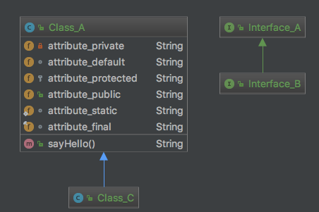
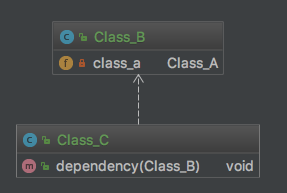
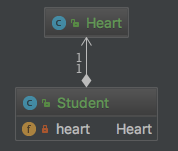

# 设计模式 学习

参考[菜鸟教程-设计模式](http://www.runoob.com/design-pattern/design-pattern-intro.html)

## 1 设计模式简介

> 设计模式（Design pattern）代表了最佳的实践，通常被有经验的面向对象的软件开发人员所采用。
设计模式是软件开发人员在软件开发过程中面临的一般问题的解决方案。
这些解决方案是众多软件开发人员经过相当长的一段时间的试验和错误总结出来的。
  
> 设计模式是一套被反复使用的、多数人知晓的、经过分类编目的、代码设计经验的总结。
使用设计模式是为了重用代码、让代码更容易被他人理解、保证代码可靠性。 
毫无疑问，设计模式于己于他人于系统都是多赢的，设计模式使代码编制真正工程化，
设计模式是软件工程的基石，如同大厦的一块块砖石一样。
项目中合理地运用设计模式可以完美地解决很多问题，每种模式在现实中都有相应的原理来与之对应，
每种模式都描述了一个在我们周围不断重复发生的问题，以及该问题的核心解决方案，这也是设计模式能被广泛应用的原因。

### 什么是 GOF（四人帮，全拼 Gang of Four）？

>在 1994 年，由 Erich Gamma、Richard Helm、Ralph Johnson 和 John Vlissides 四人合著出版了一本名为 Design Patterns - Elements of Reusable Object-Oriented Software（中文译名：设计模式 - 可复用的面向对象软件元素） 的书，该书首次提到了软件开发中设计模式的概念。
四位作者合称 GOF（四人帮，全拼 Gang of Four）。他们所提出的设计模式主要是基于以下的面向对象设计原则。
* 对接口编程而不是对实现编程
* 优先使用对象组合而不是继承

### 设计模式的使用
设计模式在软件开发中的两个主要用途。
* #### 开发人员的共同平台
> 设计模式提供了一个标准的术语系统，且具体到特定的情景。例如，单例设计模式意味着使用单个对象，这样所有熟悉单例设计模式的开发人员都能使用单个对象，并且可以通过这种方式告诉对方，程序使用的是单例模式。
* #### 最佳的实践
> 设计模式已经经历了很长一段时间的发展，它们提供了软件开发过程中面临的一般问题的最佳解决方案。学习这些模式有助于经验不足的开发人员通过一种简单快捷的方式来学习软件设计。

## 2 设计模式分类

> 根据设计模式的参考书 Design Patterns - Elements of Reusable Object-Oriented Software（中文译名：设计模式 - 可复用的面向对象软件元素） 中所提到的，
总共有 23 种设计模式。
这些模式可以分为三大类：创建型模式（Creational Patterns）、结构型模式（Structural Patterns）、行为型模式（Behavioral Patterns）。
当然，我们还会讨论另一类设计模式：J2EE 设计模式。

模式&描述 | 包括
--- | ---
**创建型模式** 这些设计模式提供了一种在创建对象的同时隐藏创建逻辑的方式， 而不是使用 new 运算符直接实例化对象。 这使得程序在判断针对某个给定实例需要创建哪些对象时更加灵活。| [工厂模式（Factory Pattern）](factory.md) [抽象工厂模式（Abstract Factory Pattern）](abstract-factory.md) [单例模式（Singleton Pattern）](singleton.md) [建造者模式（Builder Pattern）]() 原型模式（Prototype Pattern） 
**结构型模式** 这些设计模式关注类和对象的组合。 继承的概念被用来组合接口和定义组合对象获得新功能的方式。| 适配器模式（Adapter Pattern） 桥接模式（Bridge Pattern） 过滤器模式（Filter、Criteria Pattern） 组合模式（Composite Pattern） 装饰器模式（Decorator Pattern） 外观模式（Facade Pattern） 享元模式（Flyweight Pattern） 代理模式（Proxy Pattern） 
**行为型模式** 这些设计模式特别关注对象之间的通信。| 责任链模式（Chain of Responsibility Pattern） 命令模式（Command Pattern） 解释器模式（Interpreter Pattern） 迭代器模式（Iterator Pattern） 中介者模式（Mediator Pattern） 备忘录模式（Memento Pattern） 观察者模式（Observer Pattern） 状态模式（State Pattern） 空对象模式（Null Object Pattern） 策略模式（Strategy Pattern） 模板模式（Template Pattern） 访问者模式（Visitor Pattern）
**J2EE 模式** 这些设计模式特别关注表示层。这些模式是由 Sun Java Center 鉴定的。| MVC 模式（MVC Pattern） 业务代表模式（Business Delegate Pattern） 组合实体模式（Composite Entity Pattern） 数据访问对象模式（Data Access Object Pattern） 前端控制器模式（Front Controller Pattern） 拦截过滤器模式（Intercepting Filter Pattern） 服务定位器模式（Service Locator Pattern） 传输对象模式（Transfer Object Pattern）

## 3 设计模式六大原则

原则 | 简述
---|---
开闭原则 | 实现热插拔，提高扩展性
里氏代换原则 | 实现抽象的规范，实现子父类互相替换
依赖倒转原则 | 针对接口编程，实现开闭原则的基础
接口隔离原则 | 降低耦合度，接口单独设计，互相隔离
迪米特法则 | 又称不知道原则， 功能模块尽量独立
合成复用原则 | 尽量使用聚合，组合，而不是继承

### 3.1 开闭原则（Open Close Principle）
>开闭原则的意思是：对扩展开放，对修改关闭。在程序需要进行拓展的时候，不能去修改原有的代码，实现一个热插拔的效果。简言之，是为了使程序的扩展性好，易于维护和升级。想要达到这样的效果，我们需要使用接口和抽象类，后面的具体设计中我们会提到这点。
### 3.2 里氏代换原则（Liskov Substitution Principle）
>里氏代换原则是面向对象设计的基本原则之一。 里氏代换原则中说，任何基类可以出现的地方，子类一定可以出现。LSP 是继承复用的基石，只有当派生类可以替换掉基类，且软件单位的功能不受到影响时，基类才能真正被复用，而派生类也能够在基类的基础上增加新的行为。里氏代换原则是对开闭原则的补充。实现开闭原则的关键步骤就是抽象化，而基类与子类的继承关系就是抽象化的具体实现，所以里氏代换原则是对实现抽象化的具体步骤的规范。
### 3.3 依赖倒转原则（Dependence Inversion Principle）
>这个原则是开闭原则的基础，具体内容：针对接口编程，依赖于抽象而不依赖于具体。
### 3.4 接口隔离原则（Interface Segregation Principle）
>这个原则的意思是：使用多个隔离的接口，比使用单个接口要好。它还有另外一个意思是：降低类之间的耦合度。由此可见，其实设计模式就是从大型软件架构出发、便于升级和维护的软件设计思想，它强调降低依赖，降低耦合。
### 3.5 迪米特法则，又称最少知道原则（Demeter Principle）
>最少知道原则是指：一个实体应当尽量少地与其他实体之间发生相互作用，使得系统功能模块相对独立。
### 3.6 合成复用原则（Composite Reuse Principle）
>合成复用原则是指：尽量使用合成/聚合的方式，而不是使用继承。

## 4 UML基础

### 4.1 类图

>类图表示不同的实体（人、事物和数据）如何彼此相关；
换句话说，它显示了系统的静态结构。类图可用于表示逻辑类，
逻辑类通常就是业务人员所谈及的事物种类--摇滚乐队、CD、广播剧；或者贷款、住房抵押、汽车信贷以及利率。
类图还可用于表示实现类，实现类就是程序员处理的实体。实现类图或许会与逻辑类图显示一些相同的类。
然而，实现类图不会使用相同的属性来描述，因为它很可能具有对诸如Vector和HashMap这种事物的引用。
示例(Intellij idea中)：

### 4.2 类的关系

参考[【47】java的类之间的关系：泛化、依赖、关联、实现、聚合、组合](http://blog.csdn.net/lpjishu/article/details/51491779)

* #### 继承
> 继承关系也称泛化关系，指的是一个类（称为子类、子接口）继承另外的一个类（称为父类、父接口）的功能，并可以增加它自己的新功能的能力，继承是类与类或者接口与接口之间最常见的关系；在Java中此类关系通过关键字extends明确标识。

>在UML当中，对泛化关系有三个要求：
> * 子类与父类应该完全一致，父类所具有的属性、操作，子类应该都有；
> * 子类中除了与父类一致的信息以外，还包括额外的信息；
> * 可以使用父类的实例的地方，也可以使用子类的实例；

* #### 实现
> 指的是一个class类实现interface接口（可以是多个）的功能；实现是类与接口之间最常见的关系；在Java中此类关系通过关键字implements明确标识

* #### 依赖
>依赖关系(Dependency) 是一种使用关系，特定事物的改变有可能会影响到使用该事物的其他事物，在需要表示一个事物使用另一个事物时使用依赖关系。大多数情况下，依 赖关系体现在某个类的方法使用另一个类的对象作为参数。

>依赖关系有如下三种情况：
> * A类是B类中的（某中方法的）局部变量；
> * A类是B类方法当中的一个参数；
> * A类对B类的静态方法调用；
> * A类向B类发送消息，从而影响B类发生变化；

* #### 关联
> 关系是类与类之间的联接，它使一个类知道另一个类的属性和方法。关联可以是双向的，也可以是单向的。

> 给定有关联的两个类，可以从一个类的对象得到另一个类的对象。关联有两元关系和多元关系。两元关系是指一种一对一的关系，多元关系是一对多或多对一的关系。两个类之间的简单关联表示了两个同等地位类之间的结构关系。当你想要表示结构化关系时使用关联。

> __在Java语言中，关联关系一般使用成员变量来实现。__

 
* #### 聚合
> 聚合关系是关联关系的一种，是强的关联关系。
聚合是整体和个体之间的关系。例如，School类与Student类的关系便整体和个体的关系。
与关联关系一样，聚合关系也是通过实例变量实现的。
但是关联关系所涉及的两个类是处在同一层次上的，而在聚合关系中，两个类是处在不平等层次上的，
一个代表整体，另一个代表部分。

* #### 组合
>组合关系也表示类之间整体和部分的关系，但是组合关系中部分和整体具有统一的生存期。
一旦整体对象不存在，部分对象也将不存在，部分对象与整体对象之间具有 __同生共死__ 的关系。
 

### 4.3 时序图

> 时序图显示具体用例（或者是用例的一部分）的详细流程。
它几乎是自描述的，并且显示了流程中中不同对象之间的调用关系，同时还可以很详细地显示对不同对象的不同调用。

