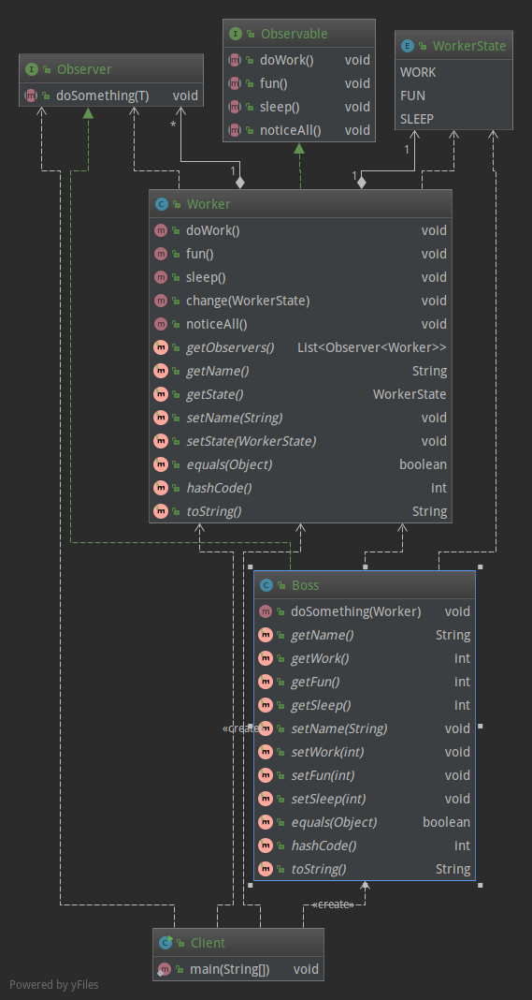

# 观察者模式(订阅-发布模式)

## 意图

> **定义对象间的一种一对多的依赖关系，当一个对象的状态发生改变时，所有依赖于它的对象都得到通知并被自动更新。** 原文: 
`Define a one-to-many dependency between objects so that when one object changes state, all its dependents are notified and updated automatically.`

## 角色

* Observable 抽象被观察者
* ConcreteObservable 具体的可观察对象
* Observer 抽象观察者
* ConcreteObserver 具体的观察者

## 类图

## 角色

* Observable 抽象被观察者
* ConcreteObservable 具体的可观察对象
* Observer 抽象观察者
* ConcreteObserver 具体的观察者

## 类图

## 优缺点

**优点:**
* 观察者与被观察者抽象解耦, 可以很方便的添加或者删除观察者;
* 建立一套通知机制
* 观察者模式符合“开闭原则”的要求

**缺点:**
* 强烈建议被观察者的noticeAll使用异步方式
* 如果存在循环通知可能会导致系统崩溃.
* 如果一个观察目标对象有很多直接和间接的观察者的话，将所有的观察者都通知到会花费很多时间。
   

## 应用

java.util.Observer(java9中已遗弃)
java.util.EventListener
javax.servlet.http.HttpSessionBindingListener
RxJava
