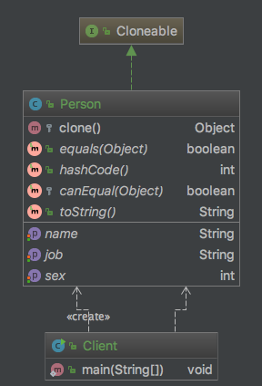

# 原型模式(Prototype Pattern)

## 1 定义
> Specify the kinds of object to create using a prototypical instance, and create new object by copying this prototype.

> 不使用new关键字创建对象，而是通过对象复制来实现新对象的创建。
    
## 2 角色
>  cloneable object

## 3 类图

## 4 优点
* 性能优良 
> 原型模式是在内存二进制流的拷贝，要比直接new一个对象性能好很多，特别是要在一个循环体重产生大量的对象时，原型模式可用更好地体现其优点。
* 逃避构造函数的约束
> 这既是它的优点也是缺点，直接在内存中拷贝，构造函数是不会执行的。优点是减少了约束，缺点也是减少了约束，需要在实际应用时考虑。

## 5 缺点

## 6 注意
* 会绕过构造器
* 遇到final字段会报错

## 7 应用
* 资源初始化场景
* 性能和安全要求的场景
* 一个对象的多个修改者的场景

    在实际应用中原型模式经常和工厂模式配合使用，通过clone方法创建一个对象，然后由工厂方法提供给调用者。