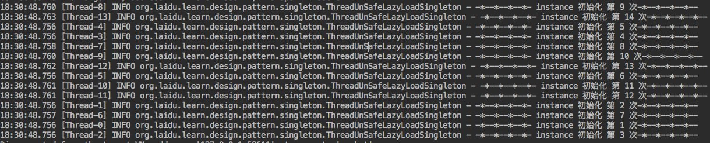

# 单例模式

>单例模式（Singleton Pattern）是 Java 中最简单的设计模式之一。这种类型的设计模式属于创建型模式，它提供了一种创建对象的最佳方式。
这种模式涉及到一个单一的类，该类负责创建自己的对象，同时确保只有单个对象被创建。这个类提供了一种访问其唯一的对象的方式，可以直接访问，不需要实例化该类的对象

## 1 介绍

* 意图：保证一个类仅有一个实例，并提供一个访问它的全局访问点。
* 主要解决：一个全局使用的类频繁地创建与销毁
* 使用场景： 
>> 1、要求生产唯一序列号。 

>> 2、WEB 中的计数器，不用每次刷新都在数据库里加一次，用单例先缓存起来。 

>> 3、创建的一个对象需要消耗的资源过多，比如 I/O 与数据库的连接等。

* 优点： 
>> 1、对于频繁使用的对象，可以省略创建对象所花费的时间，这对于那些重量级对象而言，
是非常可观的一笔系统开销；
由于 new 操作的次数减少，因而对系统内存的使用频率也会降低，这将减轻 GC 压力，缩短 GC 停顿时间。

>> 2、避免对资源的多重占用（比如写文件操作）。

* 缺点：没有接口，不能继承，与单一职责原则冲突，一个类应该只关心内部逻辑，而不关心外面怎么样来实例化。

## 2 基本实现

> 实现单例模式需要注意以下几点：

>> 1、线程安全

>> 2、延迟加载

>> 3、序列化与反序列化安全

### 2.1 

## 3 具体实现

> 这里主要介绍三种实现方式：懒汉式单例、饿汉式单例、登记式单例、枚举式单例

### 饿汉式和懒汉式区别
> 饿汉就是类一旦加载，就把单例初始化完成，保证getInstance的时候，单例是已经存在的。
> 懒汉比较懒，只有当调用getInstance的时候，才回去初始化这个单例。

方式 | 加载过程 | 线程安全 | 资源加载和性能
---|---|---|---
饿汉加载 | 类被创建时 | 线程安全 | 第一次调用时速度会更快，因为其资源已经初始化完成
懒汉加载 | 当调用getInstance()方法时 | 非线程安全 | 第一次调用时要做初始化，如果要做的工作比较多，性能上会有些延迟，之后就和饿汉式一样了。

### 3.1 懒汉式单例实现

### 3.1.1 非线程安全实现

> 代码实现：

    private static ThreadUnSafeLazyLoadSingleton ourInstance;

    private static AtomicInteger initCount = new AtomicInteger(0);

    public static ThreadUnSafeLazyLoadSingleton getInstance() {

        if (ourInstance == null) {
            ourInstance = new ThreadUnSafeLazyLoadSingleton();
        }
        return ourInstance;
    }
    
    // 测试
    private ThreadUnSafeLazyLoadSingleton() {
        int count = initCount.incrementAndGet(); // initCount.incrementAndGet() ; System.out.println(initCount); 为两步操作
        log.info("-*--*--*--*- instance 初始化 第 {} 次-*--*--*--*--", count);
    }
    
> 测试代码：

    public static void main(String[] args) {

        for (int i=0; i<1000; i++){
            new Thread(ThreadUnSafeLazyLoadSingleton::getInstance).start();
        }

    }
    
> 执行结果：

### 3.1.2 在getInstance方法上加同步
