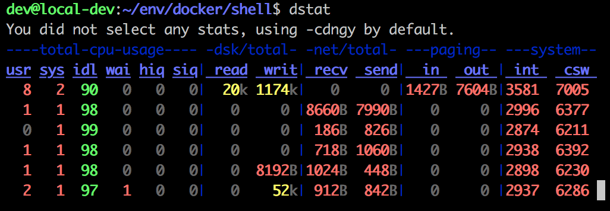
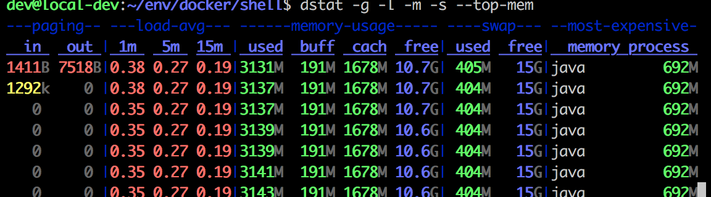
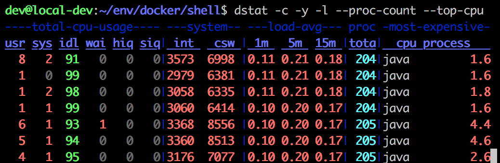
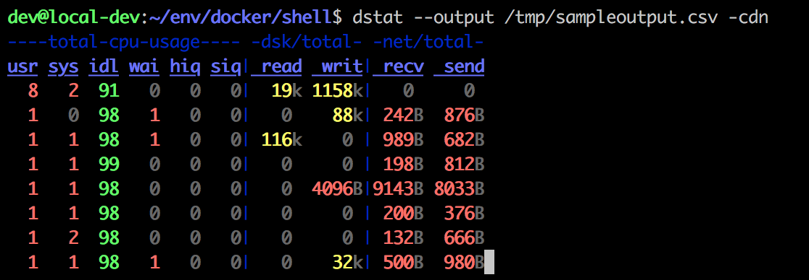

# dstat 命令使用

## 1 简介
> dstat 是一个可以取代vmstat，iostat，netstat和ifstat这些命令的多功能产品。dstat克服了这些命令的局限并增加了一些另外的功能，增加了监控项，也变得更灵活了。dstat可以很方便监控系统运行状况并用于基准测试和排除故障。详情参考：[linux-man-page](https://linux.die.net/man/1/dstat)
## 2 功能
* 实时查看系统资源，如磁盘IO、网络IO、CPU使用率、内存等；<br/>
* 支持输出CSV格式报表，并能导入到Gnumeric和Excel以生成图形
* 使用python编写的，更方便扩展现有的工作任务
* 在分析和排障时可以通过启用监控项并排序
* 极准确的时间精度，即便是系统负荷较高也不会延迟显示
## 3 用法
### 3.1 基本用法
```bash
dstat
```


__CPU状态：__ CPU的使用率。这项报告更有趣的部分是显示了用户，系统和空闲部分，这更好地分析了CPU当前的使用状况。如果你看到"wait"一栏中，CPU的状态是一个高使用率值，那说明系统存在一些其它问题。当CPU的状态处在"waits"时，那是因为它正在等待I/O设备（例如内存，磁盘或者网络）的响应而且还没有收到。<br/>
__磁盘统计：__ 磁盘的读写操作，这一栏显示磁盘的读、写总数。<br/>
__网络统计：__ 网络设备发送和接受的数据，这一栏显示的网络收、发数据总数。<br/>
__分页统计：__ 系统的分页活动。分页指的是一种内存管理技术用于查找系统场景，一个较大的分页表明系统正在使用大量的交换空间，或者说内存非常分散，大多数情况下你都希望看到page in（换入）和page out（换出）的值是0 0。<br/>
__系统统计：__ 这一项显示的是中断（int）和上下文切换（csw）。这项统计仅在有比较基线时才有意义。这一栏中较高的统计值通常表示大量的进程造成拥塞，需要对CPU进行关注。你的服务器一般情况下都会运行运行一些程序，所以这项总是显示一些数值。<br/>

> 默认情况下，dstat每秒都会刷新数据。如果想退出dstat，你可以按"CTRL-C"键。<br/>

### 3.2 常用参数
* -l ：显示负载统计量
* -m ：显示内存使用率（包括used，buffer，cache，free值）
* -r ：显示I/O统计
* -s ：显示交换分区使用情况
* -t ：将当前时间显示在第一行
* -fs ：显示文件系统统计数据（包括文件总数量和inodes值）
* –nocolor ：不显示颜色（有时候有用）
* –socket ：显示网络统计数据
* –tcp ：显示常用的TCP统计
* –udp ：显示监听的UDP接口及其当前用量的一些动态数据

### 3.3 常用插件
> dstat附带了一些插件很大程度地扩展了它的功能。你可以通过查看/usr/share/dstat目录来查看它们的一些使用方法，常用的有这些：

* --disk-util ：显示某一时间磁盘的忙碌状况
* --freespace ：显示当前磁盘空间使用率
* --proc-count ：显示正在运行的程序数量
* --top-bio ：指出块I/O最大的进程
* --top-cpu ：图形化显示CPU占用最大的进程
* --top-io ：显示正常I/O最大的进程
* --top-mem ：显示占用最多内存的进程

### 3.4 示例
* 查看全部内存都有谁在占用：
```bash
dstat -g -l -m -s --top-mem
```

* 显示一些关于CPU资源损耗的数据：
```bash
dstat -c -y -l --proc-count --top-cpu
```

* 想输出一个csv格式的文件用于以后，可以通过下面的命令：
```bash
dstat --output /tmp/sampleoutput.csv -cdn
```

参考：
* [Linux终端下 dstat 监控工具](https://linux.cn/article-3215-1.html)