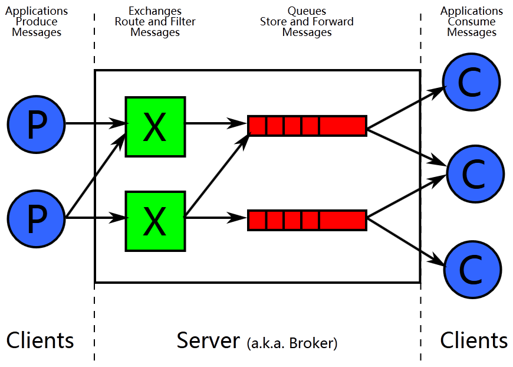
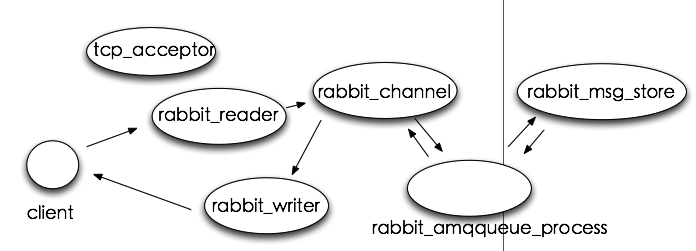

# rabbitmq 学习 

## 1、简介
__MQ ：__ MQ全称为Message Queue, 消息队列（MQ）是一种应用程序对应用程序的通信方法。应用程序通过读写出入队列的消息（针对应用程序的数据）来通信，而无需专用连接来链接它们。消息传递指的是程序之间通过在消息中发送数据进行通信，而不是通过直接调用彼此来通信，直接调用通常是用于诸如远程过程调用的技术。排队指的是应用程序通过 队列来通信。队列的使用除去了接收和发送应用程序同时执行的要求。其中较为成熟的MQ产品有IBM WEBSPHERE MQ等等。 
__RabbitMQ：__ RabbitMQ是实现了高级消息队列协议（AMQP）的开源消息代理软件（亦称面向消息的中间件）。RabbitMQ服务器是用Erlang语言编写的，而群集和故障转移是构建在开放电信平台框架上的。所有主要的编程语言均有与代理接口通讯的客户端库。

#### 1.1 特点
> RabbitMQ轻量级，易于部署在云端和云端。它支持多种消息传递协议。RabbitMQ的可分布式和联合的配置进行部署，以满足高规模，高可用性要求。以下是rabbitmq官网总结的6大特性：
* __Asynchronous Messaging__  支持多种消息协议，消息队列，传送确认，灵活的路由到队列，多种交换类型
* __Developer Experience__ 支持多种开发语言如如Java，.NET，PHP，Python，JavaScript，Ruby，Go和其他许多语言
* __Distributed Deployment__ 支持部署为高可用性和吞吐量的群集
* __Enterprise & Cloud Ready__ 可插入的身份验证，授权，支持TLS和LDAP。公共云和私有云轻量级且易于部署。
* __Tools & Plugins__ 多种工具和插件支持持续集成，运营指标以及与其他企业系统的集成。灵活的扩展RabbitMQ功能的插件方法。
* __Management & Monitoring__ HTTP-API，命令行工具和用于管理和监视RabbitMQ的UI。
#### 1.2 场景
* 异步处理
* 应用解耦
* 流量削峰
#### 1.3 开发
> [Contributors Page](https://www.rabbitmq.com/github.html)
##### 1.3.1 开发环境
> [开发环境搭建](https://github.com/rabbitmq/rabbitmq-website/)
##### 1.3.2 开发社区
> [devtools](https://www.rabbitmq.com/devtools.html)

#### 1.4 同类产品
[Apache ActiveMQ](http://activemq.apache.org)、[Apache Kafka](https://kafka.apache.org/)、[Apache RocketMQ](https://github.com/apache/rocketmq)(原Alibaba)...

## 2、架构设计
### 2.1 系统架构

几个概念说明:  
__Broker:__ 它提供一种传输服务,它的角色就是维护一条从生产者到消费者的路线，保证数据能按照指定的方式进行传输。  
__Exchange:__ 消息交换机,它指定消息按什么规则,路由到哪个队列。  
__Queue:__ 消息的载体,每个消息都会被投到一个或多个队列。  
__Binding:__ 绑定，它的作用就是把exchange和queue按照路由规则绑定起来。  
__Routing Key:__ 路由关键字,exchange根据这个关键字进行消息投递。  
__Vhost:__ 虚拟主机,一个broker里可以有多个vhost，用作不同用户的权限分离。  
__Producer:__ 消息生产者,就是投递消息的程序。 
__Consumer:__ 消息消费者,就是接受消息的程序。 
__Channel:__ 消息通道,在客户端的每个连接里,可建立多个channel。 

其中Exchange分为以下4种：

类型 | 预先声明的默认名称 | 说明
--- | --- | ---
Direct exchange | (Empty string) and amq.direct | 默认使用，直连交换机是一种带路由功能的交换机，一个队列会和一个交换机绑定， 除此之外再绑定一个routing_key，当消息被发送的时候，需要指定一个binding_key， 这个消息被送达交换机的时候，就会被这个交换机送到指定的队列里面去。同样的一个binding_key也是支持应用到多个队列中的
Fanout exchange | amq.fanout | 直接将消息转发到所有binding的对应queue中，这种exchange在路由转发的时候，忽略Routing key。
Topic exchange | amq.topic | 将消息中的Routing key与该Exchange关联的所有Binding中的Routing key进行对比，如果 __匹配__ 上了，则发送到该Binding对应的Queue中。
Headers exchange | amq.match (and amq.headers in RabbitMQ) | 忽略路由键属性。将消息中的headers与该Exchange相关联的所有Binging中的参数进行匹配，如果匹配上了，则发送到该Binding对应的Queue中。不经常使用。

> __执行效率:__ fanout > direct > topic

### 2.2 进程模型

__tcp_acceptor__ 进程接收客户端连接，创建rabbit_reader、rabbit_writer、rabbit_channel进程。
__rabbit_reader__ 接收客户端连接，解析AMQP帧；
rabbit_writer向客户端返回数据；
rabbit_channel解析AMQP方法，对消息进行路由，然后发给相应队列进程。
rabbit_amqqueue_process是队列进程，在RabbitMQ启动（恢复durable类型队列）或创建队列时创建。
rabbit_msg_store是负责消息持久化的进程。 
在整个系统中，存在一个tcp_accepter进程，一个rabbit_msg_store进程，有多少个队列就有多少个rabbit_amqqueue_process进程，每个客户端连接对应一个rabbit_reader和rabbit_writer进程。

## 3、性能参数

## 4、安装
#### 4.1 基础配置
#### 4.2 使用

## 性能调优
## 遇到的问题
__参考:__
* [wikipedia-rabbitmq](https://en.wikipedia.org/wiki/RabbitMQ)
* [rabbitmq-server-doc](https://www.rabbitmq.com/admin-guide.html)
* [rabbitmq百度百科](https://baike.baidu.com/item/rabbitmq/9372144?fr=aladdin#2)
* [RabbitMQ进程结构分析与性能调优](https://www.qcloud.com/community/article/164816001481011847)
* [What can RabbitMQ do for you?](https://www.rabbitmq.com/features.html)
* 