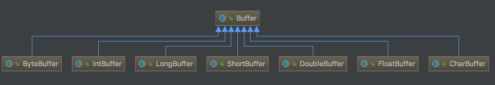

# java NIO 学习

> java.nio 包说明

> * __Buffers__  一个用于特定基本类型数据的容器, 对于每个非 boolean 基本类型，此类都有一个子类与之对应;

> * __Charsets__ 16 位的 Unicode 代码单元序列和字节序列之间的指定映射关系。此类定义了用于创建解码器和编码器以及获取与 charset 关联的各种名称的方法。此类的实例是不可变的。

> * __Channels__ 用于 I/O 操作的连接。通道表示到实体，如硬件设备、文件、网络套接字或可以执行一个或多个不同 I/O 操作（如读取或写入）的程序组件的开放的连接。

> * __Selectors__ 可通过调用此类的 open 方法创建选择器，该方法将使用系统的默认选择器提供者创建新的选择器。

## 1 Buffer 缓冲区

> 位于 java.nio 下，一个用于特定基本类型数据的容器。

> 缓冲区是特定基本类型元素的线性有限序列。除内容外，缓冲区的基本属性还包括容量、限制和位置：

    缓冲区的容量 是它所包含的元素的数量。缓冲区的容量不能为负并且不能更改。
    
    缓冲区的限制 是第一个不应该读取或写入的元素的索引。缓冲区的限制不能为负，并且不能大于其容量。
    
    缓冲区的位置 是下一个要读取或写入的元素的索引。缓冲区的位置不能为负，并且不能大于其限制。

> 对于每个非 boolean 基本类型，此类都有一个子类与之对应。

> 类图 ：

  

> Java NIO Buffers用于和NIO Channel交互。从channel中读取数据到buffers里，从buffer把数据写入到channels.

> buffer本质上就是一块内存区，可以用来写入数据，并在稍后读取出来。这块内存被NIO Buffer包裹起来，对外提供一系列的读写方便开发的接口。

### 1.1 Buffer基本用法（Basic Buffer Usage）

> 利用Buffer读写数据，通常遵循四个步骤：

> * 把数据写入buffer；
> * 调用flip；
> * 从Buffer中读取数据；
> * 调用buffer.clear()或者buffer.compact()

> 当写入数据到buffer中时，buffer会记录已经写入的数据大小。当需要读数据时，通过flip()方法把buffer从写模式调整为读模式；在读模式下，可以读取所有已经写入的数据。
  
> 当读取完数据后，需要清空buffer，以满足后续写入操作。清空buffer有两种方式：调用clear()或compact()方法。clear会清空整个buffer，compact则只清空已读取的数据，未被读取的数据会被移动到buffer的开始位置，写入位置则近跟着未读数据之后。

### 1.2 Buffer的容量，位置，上限（Buffer Capacity, Position and Limit）

> buffer缓冲区实质上就是一块内存，用于写入数据，也供后续再次读取数据。这块内存被NIO Buffer管理，并提供一系列的方法用于更简单的操作这块内存。

> 一个Buffer有三个属性是必须掌握的，分别是：

> * capacity容量
> * position位置
> * limit限制

> position和limit的具体含义取决于当前buffer的模式。capacity在两种模式下都表示容量。

## 2 Channels

## 3 Selectors

参考:
* 
* 