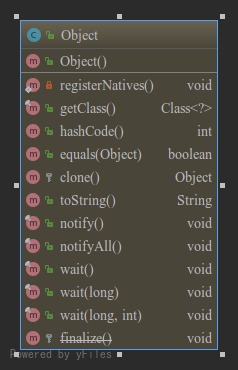

# Object 深入解析

##1、 简介
> 类 Object 是类层次结构的根类。每个类都使用 Object 作为超类。所有对象（包括数组）都实现这个类的方法。(未继承任何超类的类将自动继承Object)

##2、类图



##3、方法预览(API)

方法签名 | 描述
--- | ---
protected native Object clone() | 创建并返回此对象的一个副本。
public boolean equals(Object obj) | 指示其他某个对象是否与此对象“相等”。
protected void finalize() | 当垃圾回收器确定不存在对该对象的更多引用时，由对象的垃圾回收器调用此方法。
public final native Class<?> getClass() | 返回此 Object 的运行时类。
public native int hashCode() | 返回该对象的哈希码值。
public final native void notify() | 唤醒在此对象监视器上等待的单个线程。
public final native void notifyAll() | 唤醒在此对象监视器上等待的所有线程。
private static native void registerNatives() | 其主要作用是将C/C++中的方法映射到Java中的native方法，实现方法命名的解耦。
public String toString() | 返回该对象的字符串表示。
public final void wait() | 在其他线程调用此对象的 notify() 方法或 notifyAll() 方法前，导致当前线程等待。
public final void wait(long timeout) | 在其他线程调用此对象的 notify() 方法或 notifyAll() 方法，或者超过指定的时间量前，导致当前线程等待。
public final void wait(long timeout, int nanos) | 在其他线程调用此对象的 notify() 方法或 notifyAll() 方法，或者其他某个线程中断当前线程，或者已超过某个实际时间量前，导致当前线程等待。

##4、常用方法解析

### 4.1、clone

> 创建并返回此对象的一个副本。

java 源码：
```java
protected native Object clone() throws CloneNotSupportedException;
```
[c源码](http://hg.openjdk.java.net/jdk8u/jdk8u60/jdk/file/37a05a11f281/src/share/native/java/lang/Object.c)：
```c++
```
#### 4.1.1 java创建对象的几种方式

方式 | 描述 | 原理
---|---|---
new 关键字 | 调用构造器 | 调用构造器
反射 | 通过反射调用newInstance或者调用指定Constructor创建对象 | 通过调用构造器
clone | 通过clone获取对象副本 | 通过native clone方法
序列化 | 通过序列化创建新实例 | 通过序列化

```
        // 通过new关键字创建新对象
        RawObject o1 = new RawObject();

        // 使用clone方式创建指定对象副本，前提是该对象必须实现Cloneable接口
        RawObject o2 = (RawObject) o1.clone();

        // 使用反射方法中的newInstance调用无参构造器, 前提是该对象必须提供了无参构造器
        RawObject o3 = o2.getClass().newInstance();

        // 使用反射获取构造器，通过指定构造器创建新对象, 该类必须实现序列化接口
        for (Constructor<?> constructor : o3.getClass().getConstructors()) {
            Object o = constructor.newInstance(null);
        }

        // 通过序列化创建新对象
        String fileName = System.getProperty("user.dir")+"/language-feature/src/main/resources/rawObject.bin";
        try (ObjectOutputStream out = new ObjectOutputStream(new FileOutputStream(new File(fileName)))) {
            out.writeObject(o2);
        }
        RawObject o4 = null;
        try(ObjectInputStream in = new ObjectInputStream(new FileInputStream(new File(fileName)))) {
            o4 = (RawObject) in.readObject();
        } catch (ClassNotFoundException e) {
            e.printStackTrace();
        }
```

#### 4.1.2 深克隆与浅克隆
> * 浅克隆 只克隆当前对象和引用对象的引用 
> * 深克隆 克隆当前对象及其应用对象

#### 4.1.3 关于原型模式

### 4.2、hashCode & equals

java 源码：
```java
public native int hashCode();
```
[c源码](http://hg.openjdk.java.net/jdk8u/jdk8u60/jdk/file/37a05a11f281/src/share/native/java/lang/Object.c)：
```c++
```
#### 4.2.1、hash算法
> 散列函数（英语：Hash function）又称散列算法、哈希函数，是一种从任何一种数据中创建小的数字“指纹”的方法。散列函数把消息或数据压缩
成摘要，使得数据量变小，将数据的格式固定下来。该函数将数据打乱混合，重新创建一个叫做散列值（hash values，hash codes，hash sums，
或hashes）的指纹。散列值通常用一个短的随机字母和数字组成的字符串来代表。好的散列函数在输入域中很少出现散列冲突。在散列表和数据处理中，
不抑制冲突来区别数据，会使得数据库记录更难找到。

#### 4.2.2、hashCode方法的应用
> Object中的hashCode主要用于构建哈希表，其中包含HashMap及其相关的数据结构中。

#### 4.2.3、equals方法的应用
> 主要用于比较两个对象是否“相等”。

#### 4.2.4、默认的hashCode生成策略
```c
intptr_t ObjectSynchronizer::FastHashCode (Thread * Self, oop obj) {
  if (UseBiasedLocking) {
    // NOTE: many places throughout the JVM do not expect a safepoint
    // to be taken here, in particular most operations on perm gen
    // objects. However, we only ever bias Java instances and all of
    // the call sites of identity_hash that might revoke biases have
    // been checked to make sure they can handle a safepoint. The
    // added check of the bias pattern is to avoid useless calls to
    // thread-local storage.
    if (obj->mark()->has_bias_pattern()) {
      // Box and unbox the raw reference just in case we cause a STW safepoint.
      Handle hobj (Self, obj) ;
      // Relaxing assertion for bug 6320749.
      assert (Universe::verify_in_progress() ||
              !SafepointSynchronize::is_at_safepoint(),
             "biases should not be seen by VM thread here");
      BiasedLocking::revoke_and_rebias(hobj, false, JavaThread::current());
      obj = hobj() ;
      assert(!obj->mark()->has_bias_pattern(), "biases should be revoked by now");
    }
  }

  // hashCode() is a heap mutator ...
  // Relaxing assertion for bug 6320749.
  assert (Universe::verify_in_progress() ||
          !SafepointSynchronize::is_at_safepoint(), "invariant") ;
  assert (Universe::verify_in_progress() ||
          Self->is_Java_thread() , "invariant") ;
  assert (Universe::verify_in_progress() ||
         ((JavaThread *)Self)->thread_state() != _thread_blocked, "invariant") ;

  ObjectMonitor* monitor = NULL;
  markOop temp, test;
  intptr_t hash;
  markOop mark = ReadStableMark (obj);

  // object should remain ineligible for biased locking
  assert (!mark->has_bias_pattern(), "invariant") ;

  if (mark->is_neutral()) {
    hash = mark->hash();              // this is a normal header
    if (hash) {                       // if it has hash, just return it
      return hash;
    }
    hash = get_next_hash(Self, obj);  // allocate a new hash code
    temp = mark->copy_set_hash(hash); // merge the hash code into header
    // use (machine word version) atomic operation to install the hash
    test = (markOop) Atomic::cmpxchg_ptr(temp, obj->mark_addr(), mark);
    if (test == mark) {
      return hash;
    }
    // If atomic operation failed, we must inflate the header
    // into heavy weight monitor. We could add more code here
    // for fast path, but it does not worth the complexity.
  } else if (mark->has_monitor()) {
    monitor = mark->monitor();
    temp = monitor->header();
    assert (temp->is_neutral(), "invariant") ;
    hash = temp->hash();
    if (hash) {
      return hash;
    }
    // Skip to the following code to reduce code size
  } else if (Self->is_lock_owned((address)mark->locker())) {
    temp = mark->displaced_mark_helper(); // this is a lightweight monitor owned
    assert (temp->is_neutral(), "invariant") ;
    hash = temp->hash();              // by current thread, check if the displaced
    if (hash) {                       // header contains hash code
      return hash;
    }
    // WARNING:
    //   The displaced header is strictly immutable.
    // It can NOT be changed in ANY cases. So we have
    // to inflate the header into heavyweight monitor
    // even the current thread owns the lock. The reason
    // is the BasicLock (stack slot) will be asynchronously
    // read by other threads during the inflate() function.
    // Any change to stack may not propagate to other threads
    // correctly.
  }

  // Inflate the monitor to set hash code
  monitor = ObjectSynchronizer::inflate(Self, obj);
  // Load displaced header and check it has hash code
  mark = monitor->header();
  assert (mark->is_neutral(), "invariant") ;
  hash = mark->hash();
  if (hash == 0) {
    hash = get_next_hash(Self, obj);
    temp = mark->copy_set_hash(hash); // merge hash code into header
    assert (temp->is_neutral(), "invariant") ;
    test = (markOop) Atomic::cmpxchg_ptr(temp, monitor, mark);
    if (test != mark) {
      // The only update to the header in the monitor (outside GC)
      // is install the hash code. If someone add new usage of
      // displaced header, please update this code
      hash = test->hash();
      assert (test->is_neutral(), "invariant") ;
      assert (hash != 0, "Trivial unexpected object/monitor header usage.");
    }
  }
  // We finally get the hash
  return hash;
}
```

#### 4.2.5、应用
#### 4.2.6、常见的hashCode相同的字符串

> 字符串 "Aa"与"BB" hashCode相同
```
        String aa = "Aa";
        String bb = "BB";

        // aa==bb : false
        log.debug("aa==bb : {}", aa==bb);

        // aa.hashCode() == bb.hashCode() : true
        log.debug("aa.hashCode() == bb.hashCode() : {}", aa.hashCode() == bb.hashCode());
```

### 4.3、wait & notify


### 4.4、getClass


参考： 
* [java se 6 api](http://tool.oschina.net/apidocs/apidoc?api=jdk-zh)
* [java-se 11 Object](https://docs.oracle.com/en/java/javase/11/docs/api/java.base/java/lang/Object.html)
* [散列函數-中文维基](https://zh.wikipedia.org/wiki/%E6%95%A3%E5%88%97%E5%87%BD%E6%95%B8)